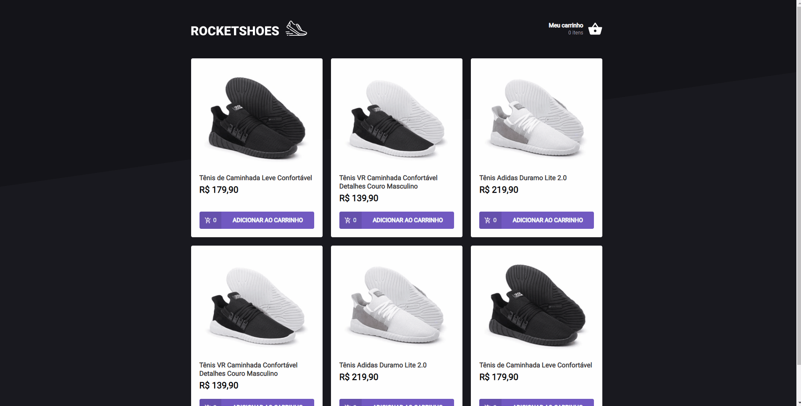
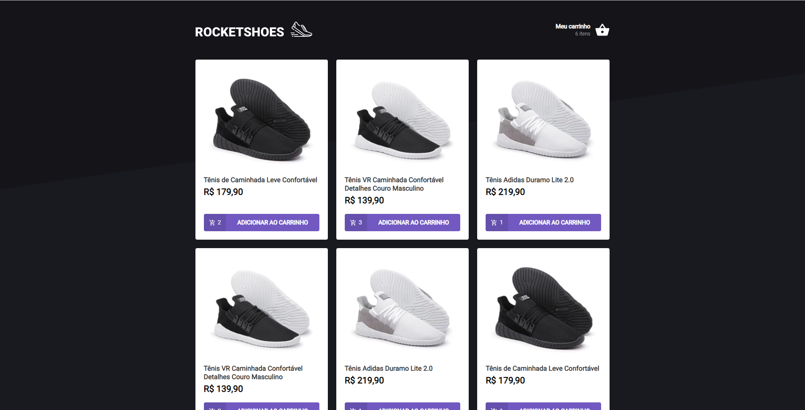
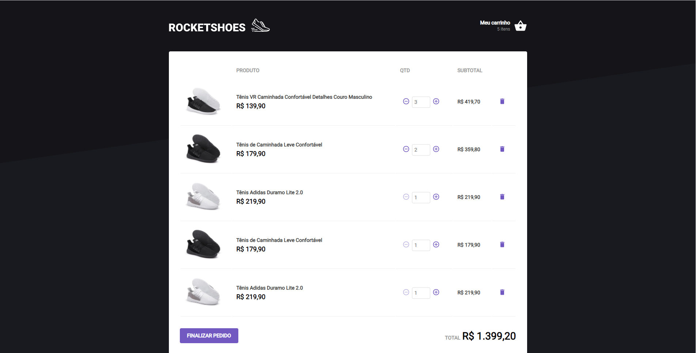

# <h1 align="center">Rocketshoes</h1>

    
    

# Sobre

Desafio do curso Ignite da <a href="https://rocketseat.com.br/">Rocketseat</a>

    Aplicação com principal objetivo de criar um hook de carrinho de compras, usando context
    api.

# 🚀 Tecnologias

<ul>
    <li>ReactJS</li>
    <li>TypeScript</li>
    <li>Context Api</li>
    <li>Axios</li>
    <li>json-server</li>
    <li>react-icons</li>
    <li>polished</li>
</ul>

# Instalação

<strong>
    Necessário ter o <a href="https://nodejs.org/en/">Node.js</a> instalado,
    um instalador de pacotes: <a href="https://www.npmjs.com/">Npm</a> ou <a href="https://yarnpkg.com/">Yarn</a>,
    para clonar o repositório use o <a href="https://git-scm.com/">Git</a>
</strong>

<pre>
# Clone o repositório
git clone https://github.com/pdrolucasz/rocketshoes.git

# Na sua linha de comando navegue até a pasta
cd rocketshoes

# Instale as dependências
yarn ou npm install

# Inicie o servidor
yarn server ou npm run server

# Inicie a aplicação
yarn start ou npm run start
</pre>

#

<h3 align="center">Made with 💜 by <a href="https://github.com/pdrolucasz">Pedro Lucas</a></h3>
